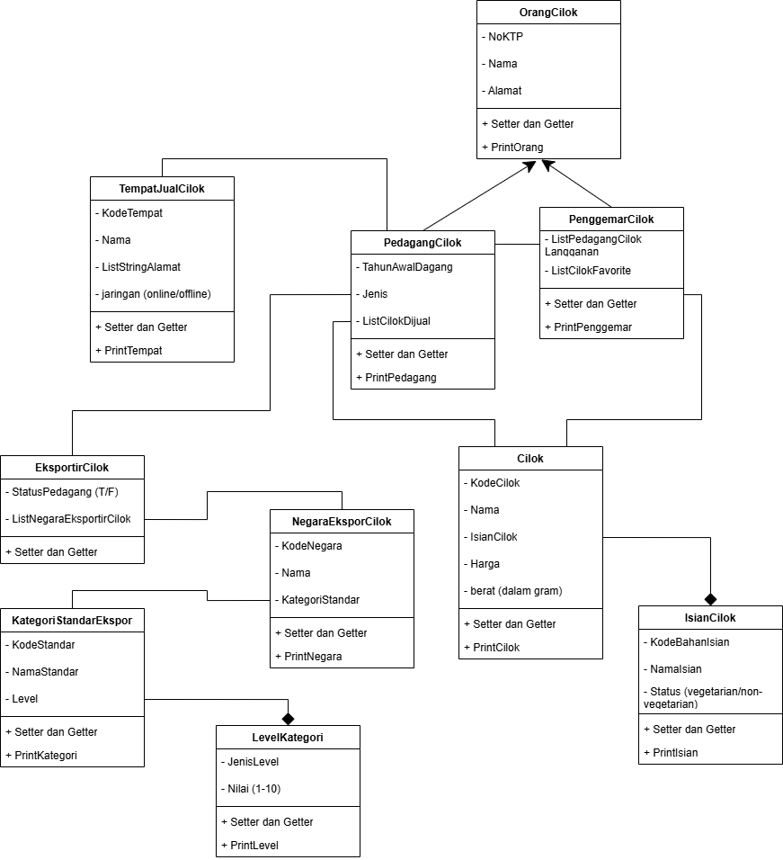

## 🧾 Janji

Saya **Muhammad ‘Azmi Salam** dengan **NIM 2406010** mengerjakan soal **Kuis 1** dalam mata kuliah **Desain Pemrograman Berorientasi Objek (DPBO)** untuk keberkahan-Nya maka saya **tidak melakukan kecurangan** seperti yang telah dispesifikasikan.  Aamiin.

## 🧩 Diagram

## 💡 Penjelasan dan Alasan

### 1. Class `OrangCilok`
Class ini dibuat sebagai *parent* dari `PedagangCilok` dan `PenggemarCilok`, karena keduanya sama-sama mewakili orang dengan atribut umum seperti `NoKTP`, `Nama`, dan `Alamat`.  
Dengan adanya class ini, atribut yang sama tidak perlu ditulis ulang di setiap class *child*.  
Selain itu, class ini bisa digunakan kembali jika di masa depan ada jenis orang lain yang terlibat dalam sistem **Paguyuban Cilok**.

### 2. Class `PedagangCilok` dan `PenggemarCilok`
Kedua class ini dibuat berbeda karena perannya berbeda:  
`PedagangCilok` adalah orang yang menjual cilok, sementara `PenggemarCilok` adalah orang yang membeli atau menyukai cilok.

#### `PedagangCilok`
Memiliki atribut tambahan:
- `TahunAwalDagang`
- `Jenis` (*reseller / produksi jual / eksportir jual*)
- `ListCilok` yang dijual (*hubungan has-a dengan* `Cilok`)

Asumsi: `PedagangCilok` di sini bermaksud sebagai **PekerjaCilok**, karena atribut `Jenis` bisa bernilai *eksportir*, sehingga dapat berelasi (*association*) dengan `EksportirCilok`.

#### `PenggemarCilok`
Memiliki atribut tambahan:
- `ListCilokFavorit`
- `ListPedagangCilokLangganan` (*hubungan has-a dengan* `PedagangCilok`)

Keduanya sama-sama *is-a* `OrangCilok`, sehingga **inheritance** dipakai untuk menghindari duplikasi atribut dasar.

### 3. Class `Cilok`
Class ini merepresentasikan produk cilok.  
Atribut:
- `KodeCilok`
- `Nama`
- `IsianCilok`
- `Harga`
- `Berat`

`Cilok` memiliki *has-a* `IsianCilok`, karena setiap cilok pasti punya bahan isian.  
Class ini tidak diwariskan ke class lain karena perannya jelas sebagai entitas produk utama.

### 4. Class `IsianCilok`
Class ini mendetailkan bahan isian cilok.  
Atribut:
- `KodeBahanIsian`
- `NamaIsian`
- `Status` (*vegetarian / non-vegetarian*)

Hubungan dengan `Cilok` adalah **composition**, karena jika cilok dihapus maka isian tersebut juga ikut hilang.  
Class ini dipisahkan agar bisa dipakai oleh banyak jenis cilok berbeda.

### 5. Class `TempatJualCilok`
Class ini mewakili lokasi atau platform tempat cilok dijual, baik **offline** (warung, gerobak) maupun **online** (marketplace).  
Atribut:
- `KodeTempat`
- `Nama`
- `ListStringAlamat`
- `Jaringan` (*online/offline*)

Hubungannya bersifat **asosiasi** dengan `PedagangCilok`, karena:
- Pedagang dapat berjualan di satu atau lebih tempat  
- Tempat dapat dipakai oleh beberapa pedagang  

Class ini berdiri sendiri karena tidak mewarisi atribut dari class lain.

### 6. Class `EksportirCilok`
Class ini membedakan pedagang khusus yang mengekspor cilok ke luar negeri.  
Atribut:
- `NoKTP`
- `Nama`
- `Alamat`
- `StatusPedagang` (*boolean, apakah juga pedagang atau tidak*)
- `ListNegaraEksporCilok`
- `ListCilok`

Hubungan dengan `NegaraEksporCilok` adalah *has-a*, karena eksportir pasti punya daftar negara tujuan.  
Class ini dipisahkan dari `PedagangCilok` karena aktivitas ekspor memiliki aturan dan atribut tambahan.

### 7. Class `NegaraEksporCilok`
Berisi data negara tujuan ekspor.  
Atribut:
- `KodeNegara`
- `Nama`
- `KategoriStandarEkspor`

Hubungannya dengan `KategoriStandarEkspor` adalah *has-a*, karena setiap negara memiliki standar ekspor tertentu.  
Class ini dipisahkan agar lebih fleksibel jika ada negara baru yang ditambahkan.

### 8. Class `KategoriStandarEkspor`
Mendetailkan standar ekspor suatu negara.  
Atribut:
- `KodeStandar`
- `NamaStandar` (*low, medium, high, dll.*)
- `Level`

Hubungannya dengan `LevelKategori` adalah *has-a*, karena kategori terdiri dari level tertentu.  
Class ini dibuat terpisah karena satu standar bisa dipakai oleh beberapa negara.

### 9. Class `LevelKategori`
Berisi detail tentang tingkat kualitas standar.  
Atribut:
- `JenisLevel` (*contoh: LevelHigienis, LevelKualitasBahan, LevelPackaging*)
- `NilaiNumerik`

Hubungan dengan `KategoriStandarEkspor` adalah **composition**,  
karena tanpa kategori, level tidak memiliki makna dalam konteks ekspor cilok.

## 🧪 Hasil Program

### 🧠 Ringkasan
Struktur program dirancang dengan konsep:
- **Inheritance** untuk menghindari duplikasi atribut antar manusia (`OrangCilok`)
- **Composition & Association** untuk relasi kuat antar objek (`Cilok`, `IsianCilok`, `TempatJualCilok`, dll.)
- **Encapsulation** agar setiap class memiliki tanggung jawab yang jelas

**© 2025 Muhammad ‘Azmi Salam**
